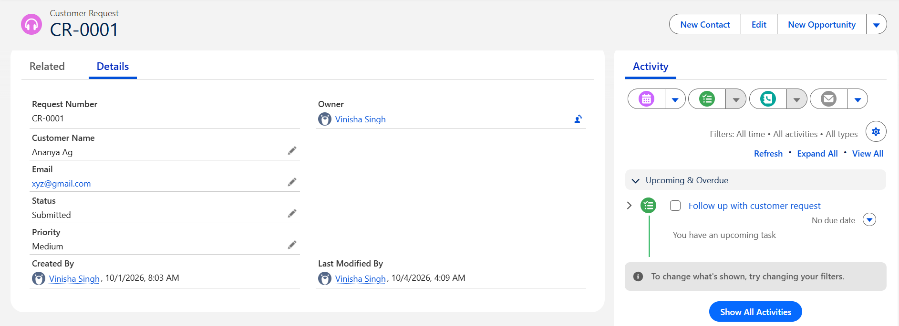
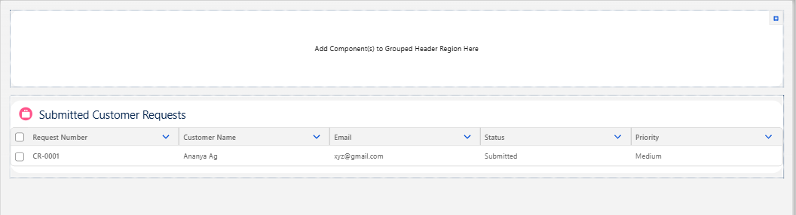

# Customer Request Management System

### Salesforce CRM application for managing customer requests, automating follow-ups, and maintaining data quality.

[](https://www.salesforce.com/)
[](https://developer.salesforce.com/docs/atlas.en-us.apexcode.meta/apexcode/)
[](https://developer.salesforce.com/docs/platform/lwc/overview)
[](https://developer.salesforce.com/docs/atlas.en-us.soql_sosl.meta/soql_sosl/)

---

##  Project Overview

The **Customer Request Management System** is a Salesforce application designed to manage customer requests through a structured CRM workflow.

The project combines **Salesforce declarative automation** with **programmatic development** to validate customer data, automate follow-up activities, apply business logic, and provide a custom Lightning Web Component for viewing submitted requests.

This project demonstrates practical experience with **Apex, SOQL, Triggers, Lightning Web Components, Flows, Validation Rules, Custom Objects, and Apex Testing**.

---

##  Problem Statement

Customer requests need to be captured consistently, validated before submission, assigned an appropriate priority, and followed up automatically.

The system addresses this by:

- Capturing customer request information
- Validating required information
- Automatically assigning a default priority
- Creating follow-up tasks
- Providing a custom interface for viewing submitted requests
- Testing the backend logic using Apex test classes

---

##  Key Features

| Feature | Implementation |
|---|---|
| Customer Request Management | Custom Salesforce Object |
| Data Validation | Validation Rule |
| Automated Follow-up | Record-Triggered Flow |
| Default Priority Assignment | Apex Trigger |
| Request Retrieval | Apex + SOQL |
| Custom User Interface | Lightning Web Component |
| Backend Testing | Apex Test Class |
| Request Display | Lightning Datatable |

---

## Salesforce Architecture

```text
                    ┌──────────────────────┐
                    │   Customer Request   │
                    │    Custom Object     │
                    └──────────┬───────────┘
                               │
              ┌────────────────┼────────────────┐
              │                │                │
              ▼                ▼                ▼
       Validation Rule    Apex Trigger     Record-Triggered
              │                │                Flow
              │                │                │
              │                ▼                ▼
              │        Default Priority     Follow-up Task
              │
              ▼
       Valid Request
              │
              ▼
       Submitted Request
              │
              ▼
      ┌───────────────────┐
      │   Apex Service    │
      │   + SOQL Query    │
      └─────────┬─────────┘
                │
                ▼
      ┌───────────────────┐
      │        LWC        │
      │ Lightning Datatable│
      └───────────────────┘


⚙️ Salesforce Components


1. Custom Object

Created a custom object:

Customer_Request__c

Fields
Field	API Name	Type
Customer Name	Customer_Name__c	Text
Email	Email__c	Email
Status	Status__c	Picklist
Priority	Priority__c	Picklist
Status Values
New
Submitted
In Progress
Completed
Rejected
Priority Values
Low
Medium
High


2. Validation Rule

A validation rule prevents a request from being submitted without an email address.

Logic
AND(
    ISPICKVAL(Status__c, "Submitted"),
    ISBLANK(Email__c)
)
Business Rule

If the request status is Submitted, an email address must be provided.

This ensures basic data quality before the request enters the submitted workflow.


3. Record-Triggered Flow

A Record-Triggered Flow runs when a Customer Request is submitted.

Workflow
Customer Request
       ↓
Status = Submitted
       ↓
Record-Triggered Flow
       ↓
Create Follow-up Task

The Flow creates a Task with:

Subject: Follow up with customer request
Status: Not Started
Priority: Normal

This demonstrates the use of Salesforce declarative automation for business processes that do not require custom Apex.


4. Apex Service Class

The CustomerRequestService Apex class retrieves submitted customer requests using SOQL.

@AuraEnabled(cacheable=true)
public static List<Customer_Request__c> getSubmittedRequests() {

    List<Customer_Request__c> requests = [
        SELECT Id, Name, Customer_Name__c,
               Email__c, Status__c, Priority__c
        FROM Customer_Request__c
        WHERE Status__c = 'Submitted'
        ORDER BY CreatedDate DESC
    ];

    return requests;
}

Key Concepts
Apex class
SOQL
@AuraEnabled
cacheable=true
List collections
LWC-Apex integration


5. Apex Trigger

A before insert trigger automatically assigns Medium priority when no priority has been specified.

trigger CustomerRequestTrigger on Customer_Request__c (before insert) {

    for (Customer_Request__c request : Trigger.new) {

        if (String.isBlank(request.Priority__c)) {
            request.Priority__c = 'Medium';
        }
    }
}
Why before insert?

The record's field value can be modified before Salesforce saves the record, so no additional DML operation is required.

Bulkification

The trigger processes Trigger.new, which can contain multiple records in a single transaction.

The implementation also avoids:

SOQL inside loops
DML inside loops

This keeps the trigger bulk-safe.


6. Lightning Web Component

The customerRequestList LWC provides a custom interface for viewing submitted requests.

Displayed Information
Request Number
Customer Name
Email
Status
Priority

The component retrieves data from Apex using the @wire decorator:

@wire(getSubmittedRequests)
requests;

The results are displayed using:

lightning-datatable

This demonstrates communication between:

LWC
 ↓
Apex
 ↓
SOQL
 ↓
Salesforce Database
🧪 Apex Testing

An Apex test class was created to verify the application's backend logic.

Test Cases
Test	Expected Result
Submitted requests retrieval	Correct records returned
Blank priority	Automatically becomes Medium
Existing High priority	Remains High
Result

3/3 test methods passed successfully.

The tests cover both the Apex service and trigger behavior.


## 📸 Application Screenshots

### Customer Request Record & Automated Follow-up

The Customer Request record shows the submitted request details along with the automatically created follow-up Task.



### Lightning Web Component

The custom LWC displays submitted customer requests using a Lightning Datatable.




📂 Project Structure
CustomerRequestProject/
│
├── force-app/
│   └── main/
│       └── default/
│           │
│           ├── classes/
│           │   ├── CustomerRequestService.cls
│           │   └── CustomerRequestServiceTest.cls
│           │
│           ├── flows/
│           │   └── Customer_Request_Create_Follow_Up_Task.flow-meta.xml
│           │
│           ├── lwc/
│           │   └── customerRequestList/
│           │       ├── customerRequestList.html
│           │       ├── customerRequestList.js
│           │       └── customerRequestList.js-meta.xml
│           │
│           ├── objects/
│           │   └── Customer_Request__c/
│           │
│           └── triggers/
│               └── CustomerRequestTrigger.trigger
│
├── config/
├── scripts/
├── sfdx-project.json
└── README.md


 Tech Stack

Platform

Salesforce

Backend

Apex
SOQL
Apex Triggers

Frontend

Lightning Web Components
Lightning Datatable

Automation

Record-Triggered Flow
Validation Rules

Development Tools

Salesforce CLI
Visual Studio Code
Salesforce Extension Pack
Git & GitHub


 Key Salesforce Concepts Demonstrated
Salesforce Data Model
Custom Objects
Custom Fields
Picklists
Validation Rules
Record-Triggered Flows
Apex Classes
SOQL
Apex Triggers
Trigger Context Variables
Bulkification
@AuraEnabled
@wire
Lightning Web Components
Lightning Datatable
Apex Test Classes
Salesforce Metadata
Git Version Control


Future Enhancements

Potential improvements include:

 Search and filter functionality in the LWC
 Salesforce dashboard for request analytics
 Automated email notifications
 Role-based access and sharing rules
 Pagination for large datasets
 Record update functionality directly from the LWC
 Request status and priority analytics

 Author
Vinisha Singh

B.Tech — Information Technology

Salesforce Developer Portfolio Project